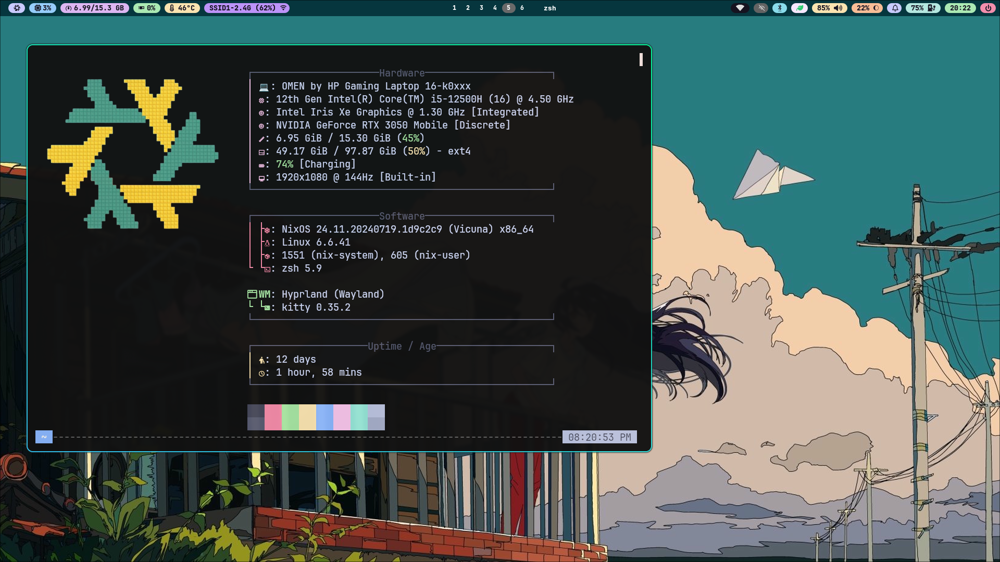
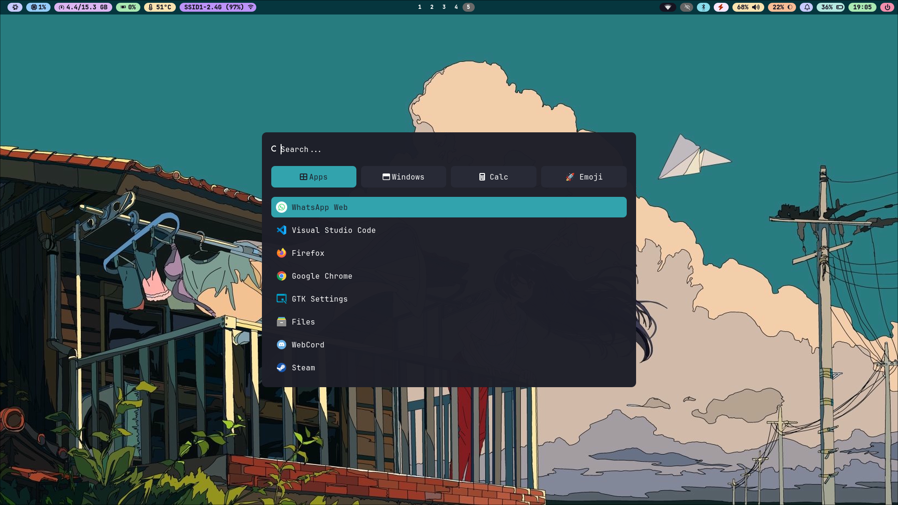

# ❄️ NixOS dotfiles

🚧 Work In Progress 🚧

Hey there !
Here is my current NixOS configuration.

I'm totally new to nix, so it's far from perfect !

This is also my first linux rice with hyprland

Feel free to tell me about any improvement that you could think of !

## Apps

- Compositor: Hyprland
- Bar: Waybar
- Shell: zsh
- Terminal: kitty
- File manager: nemo
- Lockscreen: Hyprlock
- Launchers: Rofi-Wayland
- Wallpaper manager: swww
- Screenshots: Hyprshot
- Notification: swaync
- fetch: fastfetch

## Screenshots

## References

 Thanks to [this video](https://www.youtube.com/watch?v=Cd9aRtwj9xA) which made me to try nixos

- [HeinzDev/Hyprland-dotfiles](https://github.com/HeinzDev/Hyprland-dotfiles/)
- [megaaa13/nix-dots](https://github.com/megaaa13/nix-dots/)
- [Zaney/zaneyos](https://gitlab.com/Zaney/zaneyos/)
- [vimjoyer](https://www.youtube.com/@vimjoyer)
- [nixos-hardware](https://github.com/NixOS/nixos-hardware)
- and nixos and other wiki/docs
